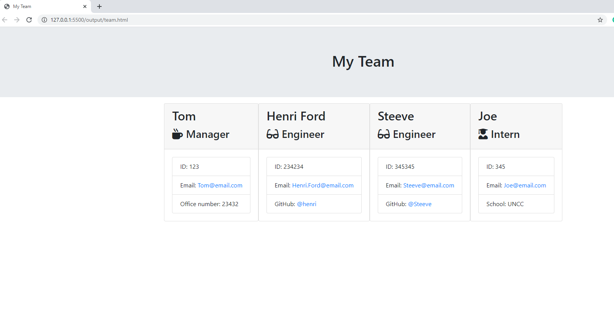
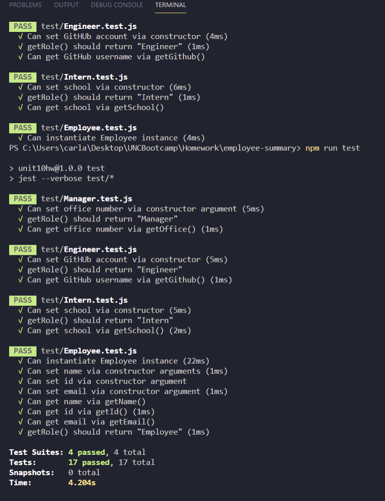

# Employee Summary

This command line application is a software team generator that will prompt the user for information about the managers and the team members.
The user can input any number of team members, and they may be a mix of engineers and interns. When the user has completed building the team, the application will create an HTML file that displays a nicely formatted team roster based on the information provided by the user.

The following demonstrates the application functionality:

[Link to video](https://drive.google.com/file/d/1QMw2f_052aFdWzLNpKk76sDpbYioXpDZ/view)

## unit test

## Author

- [@carlastjuste](http://github.com/carlastjuste)

## License

This project is licensed under the MIT License - see the LICENSE.md file for details

---

© 2021 Carla ST JUSTE, All Rights Reserved.
